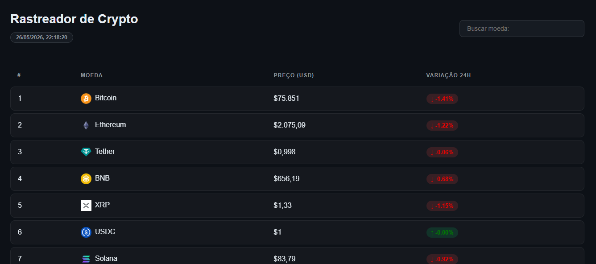

# 🚀 Crypto Tracker

Sistema web para rastreamento de criptomoedas em tempo real.

---

## 📌 Sobre o projeto

O Crypto Tracker é uma aplicação web desenvolvida para monitorar preços de criptomoedas em tempo real.

### Funcionalidades:
- Busca dinâmica de moedas
- Atualização em tempo real
- Interface Dark Mode
- Tabela com preços e variações

---

## 🛠 Tecnologias utilizadas

- HTML5
- CSS3
- JavaScript

---

## 📷 Preview

---

## 👨‍💻 Autor

Marco Tulio
