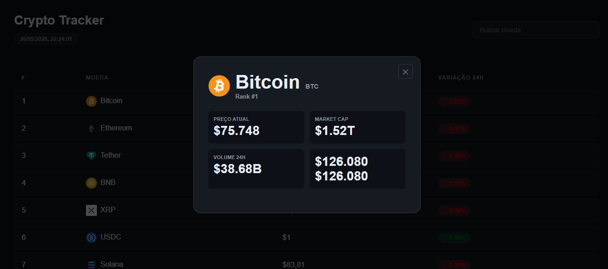
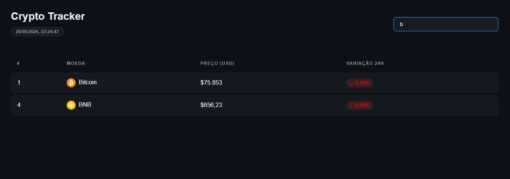

# 🚀 Crypto Tracker

## 📌 Sobre o projeto

Crypto Tracker é uma aplicação web responsiva desenvolvida para acompanhamento de criptomoedas em tempo real.  

A plataforma permite visualizar preços atualizados, variações de mercado e realizar buscas dinâmicas entre diferentes ativos digitais através de uma interface moderna e intuitiva.

O projeto foi desenvolvido utilizando HTML, CSS e JavaScript, com integração de API externa para consumo de dados em tempo real, focando em boas práticas de front-end e experiência visual do usuário.

---

### Funcionalidades:
- Busca dinâmica de moedas
- Atualização em tempo real
- Interface Dark Mode
- Tabela com preços e variações
- Informações da moeda Crypto

---

## 🛠 Tecnologias utilizadas

- HTML5
- CSS3
- JavaScript

---

## 📷 Preview
Tela príncipal:

Tela infomações ao clicar na moeda: 

Tela de pesquisa pelo buscador: 

---

## 👨‍💻 Autor

Marco Tulio Goncalves Ribeiro
